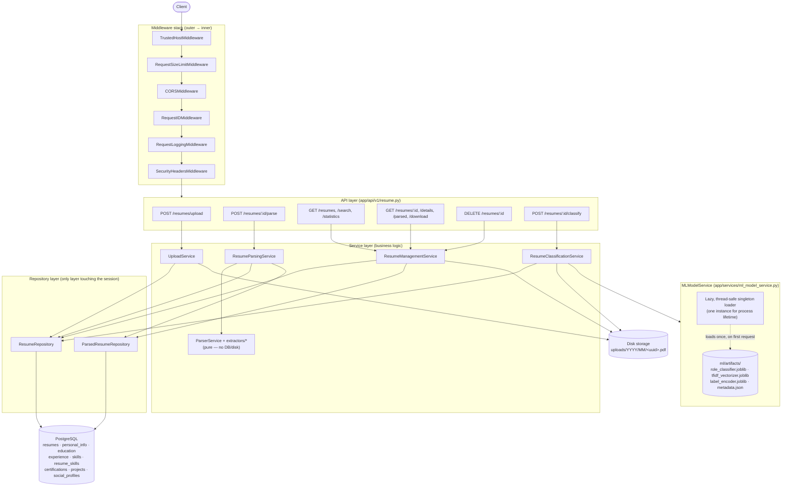

# Resume Parsing Service

[](https://github.com/DevKadiya7/Resume_Parsing/actions/workflows/backend.yml)


An AI-assisted resume screening platform: a production-hardened FastAPI
backend that accepts PDF resumes, stores them, extracts structured
information from them, and classifies each one into a likely role/industry
using a **locally-trained scikit-learn/XGBoost model** — all **without an
LLM or external AI API** — plus a React frontend that consumes those APIs
end to end (upload, parse, browse, search, classify, manage). This is the
**single README for `backend/`, `backend/ml/`, and `frontend/`**; none of
those subdirectories has its own.

**Why a classical ML model instead of an LLM?** The brief for this project
was explicit: no LLM, no external AI API. A resume's category is a
bounded, well-defined multi-class classification problem — exactly the
shape TF-IDF + a gradient-boosted tree model is good at — so a
small (~2.4 MB), self-hosted, sub-100ms model does the job without the
cost, latency, or data-privacy exposure of calling out to a hosted LLM for
every resume.

<!--
Screenshots (placeholder — add real captures before publishing):
  docs/screenshots/dashboard.png      — frontend Dashboard page
  docs/screenshots/upload-flow.png    — drag-and-drop upload -> parse walkthrough
  docs/screenshots/swagger-ui.png     — backend Swagger UI at /docs
-->

## Monorepo Structure

```
Resume_Parsing/
├── backend/     # FastAPI + SQLAlchemy 2.0 + PostgreSQL API (see "Backend" below)
│   └── ml/      # Offline ML pipeline: notebooks + trained artifacts (see "Machine Learning Pipeline")
├── frontend/    # React + Vite + Tailwind CSS UI (see "Frontend" below)
├── .github/workflows/backend.yml   # CI: lint -> test -> Docker build
├── LICENSE
└── README.md    # you are here
```

`archive/` (the raw training corpus this pipeline was built from) is
**not** part of the repository — see [Machine Learning Pipeline](#machine-learning-pipeline)
for where it comes from and why.

## Quick Start

```bash
git clone <this-repo>
cd Resume_Parsing

# 1. Backend (Postgres + API) — http://localhost:8000
cd backend
cp .env.example .env
docker compose up --build -d

# 2. Frontend — http://localhost:5173
cd ../frontend
cp .env.example .env
npm install
npm run dev
```

The AI classification model is **pre-trained and committed** at
`backend/ml/artifacts/` (~2.4 MB) — no training step is required to run the
app. `POST /api/v1/resumes/{id}/classify` works immediately after
`docker compose up`.

---

# Backend

A production-hardened backend that accepts PDF resumes, stores them, extracts
structured information from them, and exposes that data through a searchable,
paginated API. Extraction is done entirely with PyMuPDF (text), regex
(patterns), spaCy (name NER, optional), and dateparser (dates). Built
end-to-end with Clean Architecture, a fully async SQLAlchemy 2.0 stack, and a
CI pipeline that lints, type-checks, tests, and builds the Docker image on
every push.

### Project Overview

| Phase | Scope |
|-------|-------|
| **1 — Foundation** | Project setup, PostgreSQL integration, PDF upload, clean architecture |
| **2 — Parsing engine** | Regex/spaCy/dateparser extraction into 7 normalized tables |
| **3 — Management APIs** | Paginated listing, multi-field search, filtering, statistics, delete, download |
| **4 — Production hardening** | Security, structured logging, config-per-environment, performance, CI/CD, Docker |
| **5 — AI classification** | EDA → feature engineering → model training/evaluation (`backend/ml/`), `POST /{id}/classify`, lazy/thread-safe model loading, React classification UI |

### Architecture Diagram



Every arrow crossing a layer boundary goes through an abstraction (a service
depends on a repository *interface*-shaped class, never a session; a route
depends on a service, never a repository) — see [Backend Design Decisions](#backend-design-decisions).
`ResumeClassificationService` reads the resume's PDF straight from disk and
extracts its text via the same `text_extractor` the parsing pipeline uses —
classification does **not** require the resume to be parsed first, and
never retrains or mutates the model.

### Features

- **Upload** — PDF-only, 10MB limit, UUID storage filenames, date-partitioned storage.
- **Parse** — personal info, skills, education, experience, projects, certifications, social profiles — regex/spaCy/dateparser, no LLM.
- **AI Classification** — predicts a resume's most likely role/industry (34 classes) with confidence-ranked top-K predictions, via a locally-trained scikit-learn/XGBoost model — see [Machine Learning Pipeline](#machine-learning-pipeline).
- **List / Search / Filter** — pagination, sorting, 12 searchable fields, structural filters (`parsed`, `has_experience`, `minimum_experience`, ...).
- **Statistics** — corpus-wide counts and top skills/companies/colleges/degrees.
- **Delete / Download** — cascading delete (file + all parsed data), original-PDF download with correct headers.
- **Security** — TrustedHost + CORS + security headers, request-size limiting, per-endpoint rate limiting, path-traversal-safe filenames.
- **Observability** — request ID on every request/log line, request timing, structured (JSON) or human-readable logs, a health check that actually checks the database and disk.
- **Environments** — validated, fail-fast settings for development/testing/production.
- **CI/CD** — lint + test + Docker build on every push/PR.

### Technology Stack

**API runtime:** Python 3.12 · FastAPI · Uvicorn · SQLAlchemy 2.0 (async) ·
Alembic · PostgreSQL · Pydantic v2 · PyMuPDF · spaCy · dateparser · slowapi ·
scikit-learn · XGBoost · joblib · NumPy

**Tooling:** Docker · Docker Compose · Pytest · black · isort · flake8 ·
mypy · GitHub Actions

**Offline ML pipeline only** (`backend/ml/requirements.txt` — not installed
into the API runtime): pandas · SciPy · matplotlib · seaborn · Jupyter/nbconvert

### Folder Structure

```
backend/
├── app/
│   ├── api/
│   │   ├── deps.py                       # DI wiring for the whole dependency graph
│   │   └── v1/resume.py                  # upload, parse, list/search/stats, detail, delete, download
│   ├── core/
│   │   ├── config.py                     # Settings (env-validated), Environment enum
│   │   ├── logger.py                     # Text/JSON logging, request-ID injection
│   │   ├── request_context.py            # ContextVar carrying the current request ID
│   │   └── rate_limiter.py               # Shared slowapi Limiter
│   ├── db/database.py                    # Async engine, session factory, Base
│   ├── models/                           # SQLAlchemy 2.0 ORM models
│   │   ├── resume.py                     #   Resume, ResumeStatus
│   │   ├── personal_info.py              #   PersonalInfo (1:1 with Resume)
│   │   ├── social_profile.py             #   SocialProfile, SocialPlatform
│   │   ├── education.py / experience.py
│   │   ├── skill.py                      #   Skill (global catalog), ResumeSkill (join table)
│   │   ├── certification.py / project.py
│   ├── repositories/                     # Only layer that touches the DB session
│   │   ├── resume_repository.py          #   CRUD + find_all/search/statistics/delete
│   │   └── parsed_resume_repository.py   #   Parsed-data aggregate: save (transactional) + fetch
│   ├── services/
│   │   ├── upload_service.py             # Validation, storage, persistence
│   │   ├── parser_service.py             # Pure: PDF bytes -> ParsedResumeData
│   │   ├── resume_parsing_service.py     # Orchestration: fetch, dedupe-guard, parse, persist
│   │   ├── resume_management_service.py  # Orchestration: list/search/detail/stats/delete/download
│   │   ├── resume_classification_service.py  # Orchestration: fetch resume, extract text, classify
│   │   ├── ml_model_service.py           # Lazy, thread-safe model/vectorizer/encoder loader + predict
│   │   └── extractors/                   # One module per extraction concern
│   ├── schemas/                          # Pydantic v2 request/response + internal criteria
│   │   └── classification.py             # ClassificationResponse, RolePredictionSchema
│   ├── utils/                            # file_utils, skills, date_utils, query_params, experience_calculator
│   ├── middleware/
│   │   ├── request_id_middleware.py
│   │   ├── logging_middleware.py
│   │   ├── security_headers_middleware.py
│   │   ├── size_limit_middleware.py
│   │   └── exception_handler.py          # Global exception handlers -> consistent JSON errors
│   ├── exceptions/custom_exceptions.py   # AppException hierarchy (incl. ModelUnavailableException, InvalidTopKException)
│   └── main.py                           # FastAPI app, middleware stack, routes, lifespan
├── ml/                                    # Offline ML pipeline — see "Machine Learning Pipeline"
│   ├── 01_build_dataset.ipynb            # Synthetic tech-role generation + merge with real corpus -> CSV
│   ├── 02_train_classifier.ipynb         # EDA, cleaning, feature engineering, training, evaluation, export
│   ├── ai-resume-screening-system.ipynb  # Reference notebook (baseline this pipeline is compared against)
│   ├── requirements.txt                  # Training-only deps (NOT installed into the API runtime)
│   ├── data/                              # Generated by 01_*.ipynb — gitignored, reproducible via a fixed seed
│   └── artifacts/                         # Committed — what the API actually loads at runtime
│       ├── role_classifier.joblib
│       ├── tfidf_vectorizer.joblib
│       ├── label_encoder.joblib
│       ├── metadata.json
│       ├── serving_features.py           # Canonical clean_resume() training used
│       └── serving_contract.json         # Golden samples asserting API/training agreement
├── uploads/                              # PDF storage, partitioned uploads/<year>/<month>/
├── tests/                                # 141 tests, in-memory/temp-file SQLite, no Docker required
├── alembic/                               # Migrations (async env.py)
├── Dockerfile                             # multi-stage, non-root, HEALTHCHECK
├── docker-compose.yml
├── .dockerignore                          # Keeps .venv/, notebooks, tests, local uploads out of the image
├── pyproject.toml                         # black/isort/mypy config
├── .flake8
├── requirements.txt
└── .env.example / .env.test / .env.production
```

### Installation

```bash
cd backend
cp .env.example .env
```

### Running with Docker

```bash
docker compose up --build
```

Starts Postgres (with a healthcheck-gated startup) and the API on
`http://localhost:8000`. The image is a multi-stage build: dependencies
(including the spaCy model) are installed in a `builder` stage with the full
build toolchain, and only the resulting virtualenv + app code are copied into
the slim, non-root `runtime` stage — which also carries a `HEALTHCHECK`
hitting `/health`. `backend/ml/artifacts/` (the ~2.4 MB trained model) is
copied in as ordinary app code — `.dockerignore` explicitly keeps out
`.venv/`, the training notebooks, `ml/data/` (the regenerable merged
dataset), `tests/`, and any local `.env`/`uploads/` content, so the image
stays close to just "runtime code + trained model." `requirements.txt`
installs `xgboost-cpu`, not `xgboost` — the standard PyPI `xgboost` wheel
bundles GPU support and pulls in `nvidia-nccl-cu13` (~250 MB) as a hard
dependency even though this service only ever does CPU inference; measured
via an actual `docker compose build`, that single swap took the image from
**1.12 GB to 750 MB**.

### Running Locally

```bash
python -m venv .venv
source .venv/Scripts/activate   # Windows Git Bash; use .venv\Scripts\Activate.ps1 on PowerShell
pip install -r requirements.txt
python -m spacy download en_core_web_sm   # optional: enables NER-based name fallback

alembic upgrade head             # requires a running Postgres reachable at DATABASE_URL
uvicorn app.main:app --reload
```

### Environment Variables

| Variable | Description | Default |
|----------|-------------|---------|
| `ENVIRONMENT` | `development` \| `testing` \| `production` — gates production hardening checks | `development` |
| `APP_NAME` | Service name shown in OpenAPI docs | `Resume Parsing Service` |
| `DEBUG` | Enables SQL echo + `DEBUG`-level logging | `False` |
| `DATABASE_URL` | Async SQLAlchemy URL (`asyncpg` driver) | `postgresql+asyncpg://...` |
| `UPLOAD_DIRECTORY` | Root directory PDFs are written to (date-partitioned beneath it) | `uploads` |
| `MAX_FILE_SIZE` | Max PDF size in bytes (business-rule check) | `10485760` (10 MB) |
| `MAX_REQUEST_SIZE` | Hard cap on any request body, checked before routing | `12582912` (12 MB) |
| `ALLOWED_HOSTS` | Comma-separated allowed `Host` headers; `*` in dev, explicit list required in production | `*` |
| `ALLOWED_ORIGINS` | Comma-separated CORS origins; `*` in dev, explicit list required in production | `*` |
| `RATE_LIMIT_UPLOAD` | slowapi rate-limit string for `POST /upload` | `20/minute` |
| `RATE_LIMIT_PARSE` | slowapi rate-limit string for `POST /{id}/parse` | `20/minute` |
| `LOG_FORMAT` | `text` (console) or `json` (structured, for log aggregators) | `text` |
| `ML_ARTIFACTS_DIRECTORY` | Where `MLModelService` loads the model/vectorizer/encoder/metadata from; relative paths resolve against the backend root | `ml/artifacts` |
| `ML_STRICT_VERSION_CHECK` | If `True`, a scikit-learn minor-version mismatch between training and serving is a fatal 503 instead of a logged warning | `False` |

Three files are provided in `backend/`:
- **`.env.example`** — local development, copy to `.env`.
- **`.env.test`** — reference only; the test suite overrides settings in-process (see Testing below) and never reads this file.
- **`.env.production`** — a template to fill in and rename; `Settings` refuses to start with `ENVIRONMENT=production` if `DEBUG`, `ALLOWED_HOSTS`, `ALLOWED_ORIGINS`, or `DATABASE_URL` are still left at permissive/local defaults.

### Database Migration

```bash
alembic upgrade head                              # apply all migrations
alembic revision --autogenerate -m "Description"  # after changing a model
```

| Migration | Adds |
|-----------|------|
| `202608040001_initial` | `resumes` |
| `202608040002_add_parsed_resume_tables` | `personal_info`, `social_profiles`, `education`, `experience`, `skills`, `resume_skills`, `certifications`, `projects` — all FK'd to `resumes.id` with `ON DELETE CASCADE` |
| `202608040003_add_query_indexes` | Indexes on every sorted/filtered/searched column |

### Testing

```bash
cd backend
pip install -r requirements.txt
pytest -v
```

**141 tests, no Docker/Postgres required** — an in-memory-per-process,
file-based SQLite database (not `:memory:` + a single shared connection,
which can't run overlapping transactions — see the comment in
`backend/tests/conftest.py`) and a `tmp_path` upload directory, wired in via
FastAPI dependency overrides so production code paths run unmodified.
`PRAGMA foreign_keys=ON` is explicitly enabled on every test connection
(SQLite ignores `ON DELETE CASCADE` otherwise) so cascade-delete is tested
against the real constraint, not silently skipped.

| File | Covers |
|------|--------|
| `test_health.py` | Root + health endpoint (DB/upload-dir/version/uptime) |
| `test_upload.py` | Valid upload, reject non-PDF, reject oversized, reject missing |
| `test_parser_service.py` | Extraction unit tests: multi-page, missing sections, corrupted/encrypted/empty PDFs, skill/email/phone parsing |
| `test_parse_api.py` | Parse/get-parsed HTTP flows, corrupted/encrypted/empty PDF (422), missing-on-disk (500), duplicate parse (409), not-found (404) |
| `test_resume_management.py` | Pagination, sorting, filtering, search (single + combined fields), statistics, delete (incl. a direct-DB orphaned-row check across every child table), download |
| `test_classification.py` | Model loading (lazy, cached, thread-safe-concurrent), prediction correctness/sorting, `top_k` validation, missing/corrupted/version-mismatched artifacts (503), the `/classify` endpoint end to end (200/404/422/503), no internal detail leaked in error bodies |
| `test_edge_cases.py` | Large (multi-page) resume, tiny resume, Unicode resume, duplicate upload, concurrent upload |
| `test_security.py` | Request ID, response-time header, security headers, CORS, 413 on oversized body, filename sanitization/rejection |
| `test_file_utils.py` | Filename safety helpers as pure unit tests |
| `test_config.py` | Production settings validation, comma-separated env parsing |
| `test_rate_limiting.py` | The shared rate limiter actually blocks after its configured limit |

`test_classification.py` skips itself (rather than failing) if
`backend/ml/artifacts/` is absent — real Phase 1 artifacts are used instead
of a mock, so these tests catch the actual shipped model failing to load,
not just an interface contract.

Code quality — all clean on this codebase:

```bash
black --check app tests
isort --check-only app tests
flake8 app tests
mypy app
```

### API Documentation

Swagger UI: `http://localhost:8000/docs` · ReDoc: `/redoc` · raw schema: `/openapi.json`.
Every endpoint has a `summary`, a `description`, a `response_model`, documented
error responses, and — for the response bodies clients most need to
understand — a worked JSON example embedded via `json_schema_extra`.

#### Endpoints

| Method | Path | Description |
|--------|------|--------------|
| GET | `/` | Service info |
| GET | `/health` | DB connectivity, upload-dir check, version, uptime |
| POST | `/api/v1/resumes/upload` | Upload a PDF resume (rate-limited) |
| GET | `/api/v1/resumes` | List resumes — pagination, sorting, filters |
| GET | `/api/v1/resumes/search` | Multi-field partial/case-insensitive search |
| GET | `/api/v1/resumes/statistics` | Corpus-wide aggregate statistics |
| POST | `/api/v1/resumes/{resume_id}/parse` | Parse an uploaded resume (rate-limited) |
| POST | `/api/v1/resumes/{resume_id}/classify` | Predict role/industry — `?top_k=N` (default 3); works without parsing first |
| GET | `/api/v1/resumes/{resume_id}/parsed` | Fetch parsed data (404 if not parsed yet) |
| GET | `/api/v1/resumes/{resume_id}/details` | Metadata + full nested parsed data |
| GET | `/api/v1/resumes/{resume_id}/download` | Download the original PDF |
| GET | `/api/v1/resumes/{resume_id}` | Single resume's metadata |
| DELETE | `/api/v1/resumes/{resume_id}` | Delete (file + metadata + parsed data, cascades) |

> **Route-ordering note:** `/search` and `/statistics` are registered before
> the dynamic `/{resume_id}` in `app/api/v1/resume.py` — otherwise FastAPI
> would try to parse "search"/"statistics" as a UUID and 422 instead of
> reaching the real handler.

### Example Requests

```bash
# Upload
curl -X POST http://localhost:8000/api/v1/resumes/upload \
  -F "file=@jane_doe_resume.pdf;type=application/pdf"

# Parse
curl -X POST http://localhost:8000/api/v1/resumes/3fa85f64-5717-4562-b3fc-2c963f66afa6/parse

# Classify — top 3 predicted roles by default
curl -X POST "http://localhost:8000/api/v1/resumes/3fa85f64-5717-4562-b3fc-2c963f66afa6/classify?top_k=3"

# List — page 2, 10 per page, newest first, only parsed resumes
curl "http://localhost:8000/api/v1/resumes?page=2&page_size=10&sort=created_at&order=desc&parsed=true"

# Search — Python developers who worked at Google
curl "http://localhost:8000/api/v1/resumes/search?skill=python&company=google"

# Statistics
curl "http://localhost:8000/api/v1/resumes/statistics"

# Delete
curl -X DELETE http://localhost:8000/api/v1/resumes/3fa85f64-5717-4562-b3fc-2c963f66afa6

# Download
curl -OJ http://localhost:8000/api/v1/resumes/3fa85f64-5717-4562-b3fc-2c963f66afa6/download
```

### Example Responses

<details>
<summary><code>POST /api/v1/resumes/{id}/classify</code> → 200</summary>

```json
{
  "resume_id": "3fa85f64-5717-4562-b3fc-2c963f66afa6",
  "predicted_role": "DATA-ENGINEER",
  "confidence": 0.612431,
  "top_predictions": [
    {"role": "DATA-ENGINEER", "confidence": 0.612431},
    {"role": "ML-ENGINEER", "confidence": 0.104882},
    {"role": "BACKEND-DEVELOPER", "confidence": 0.061237}
  ],
  "classifier_version": "XGBoost (balanced) (tuned) (2026-08-09T17:32:03+00:00)"
}
```

`confidence` values sum to 1 across **all 34 classes**, so they run lower
than a binary yes/no confidence would — a real prediction from a resume
that clearly reads as a mixed/generic profile can top out around 8-12%
rather than 90%+; see [ML Limitations](#ml-limitations). They rank
predictions reliably; they are not calibrated probabilities.
</details>

<details>
<summary><code>POST /api/v1/resumes/upload</code> → 201</summary>

```json
{
  "id": "3fa85f64-5717-4562-b3fc-2c963f66afa6",
  "filename": "jane_doe_resume.pdf",
  "status": "UPLOADED",
  "created_at": "2026-08-05T10:15:30Z"
}
```
</details>

<details>
<summary><code>POST /api/v1/resumes/{id}/parse</code> → 200</summary>

```json
{
  "success": true,
  "resume_id": "3fa85f64-5717-4562-b3fc-2c963f66afa6",
  "parsed": {
    "personal_info": {"full_name": "Jane Doe", "email": "jane.doe@example.com", "phone": "+1 555-123-4567", "address": "San Francisco, CA", "summary": "..."},
    "skills": ["Docker", "FastAPI", "Python", "SQL"],
    "education": [{"institution": "MIT", "degree": "B.Tech", "field_of_study": "Computer Science", "start_date": "2015-08-01", "end_date": "2019-05-01", "grade": "8.7 CGPA"}],
    "experience": [{"company": "Google", "job_title": "Software Engineer", "location": "Mountain View, CA", "start_date": "2020-01-01", "end_date": null, "is_current": true, "description": "..."}],
    "projects": [{"name": "Resume Parser", "description": "...", "technologies": "Python, FastAPI"}],
    "certifications": [{"name": "AWS Certified Solutions Architect", "issuer": "Amazon Web Services", "date": "2021-06-01"}],
    "social_profiles": [{"platform": "LINKEDIN", "url": "linkedin.com/in/janedoe"}]
  }
}
```
</details>

<details>
<summary><code>GET /api/v1/resumes</code> → 200</summary>

```json
{
  "page": 1, "page_size": 20, "total": 54,
  "items": [
    {"id": "3fa85f64-...", "filename": "jane_doe_resume.pdf", "status": "UPLOADED",
     "file_size": 245678, "content_type": "application/pdf", "is_parsed": true,
     "created_at": "2026-08-05T10:15:30Z", "updated_at": "2026-08-05T10:15:35Z"}
  ]
}
```
</details>

<details>
<summary><code>GET /api/v1/resumes/statistics</code> → 200</summary>

```json
{
  "total_resumes": 120, "parsed": 118, "pending": 2,
  "top_skills": [{"skill": "Python", "count": 85}],
  "top_companies": [{"company": "Google", "count": 12}],
  "top_colleges": [{"college": "MIT", "count": 9}],
  "most_common_degree": [{"degree": "B.Tech", "count": 40}]
}
```
</details>

<details>
<summary>Any error → consistent envelope</summary>

```json
{"success": false, "message": "Only PDF files are allowed."}
```

The same envelope applies to a **503** from `/classify` when the model is
unavailable — e.g. `{"success": false, "message": "Resume classification
service is currently unavailable."}` — deliberately generic: it never
reveals the artifacts' filesystem path or which specific file failed to
load (that detail is server-side logs only).
</details>

### Backend Design Decisions

- **Layering is enforced, not just documented.** Routes only translate HTTP
  ↔ schemas and delegate to services; services hold all business logic and
  depend on repository *classes* (never the session directly); repositories
  are the only layer that imports `AsyncSession`. `app/api/deps.py` wires the
  whole `session → repository → service` graph in one place.

- **`ParserService` is pure.** It takes raw PDF bytes and returns structured
  data — no DB, no disk — so it's unit-testable with synthetic PDF bytes and
  no test database (see `test_parser_service.py`). Persistence and
  resume-lookup live in `ResumeParsingService`, the orchestrator.

- **Schemas double as cross-layer DTOs.** `ParsedResumeData` and friends are
  returned by the parser, persisted/reconstructed by the repository (via
  `from_attributes`), and serialized directly as the API response — one type
  instead of a parallel dataclass hierarchy that exists only to be converted
  back and forth.

- **`EXISTS` subqueries, not `JOIN + DISTINCT`, for search/filtering.** Each
  search field lives on a different one-to-many child table; joining several
  would multiply `Resume` rows (one row per matching child row), needing
  `DISTINCT` cleanup. A correlated `EXISTS` per condition avoids that
  entirely and lets each subquery use its own index. `is_parsed` is computed
  the same way, inline in the listing query — one query returns a full page
  plus parsed-status, never one query per resume (no N+1).

- **`minimum_experience` is computed in Python, not SQL.** Total years of
  experience is a derived value (summed date-range durations) that isn't
  expressible as one SQL expression portable across Postgres and SQLite
  without dialect-specific date arithmetic. All *other* filters are still
  applied in SQL to get a candidate set first; only the derived-value
  computation runs in Python, over that (typically small) set.

- **Rate limits are per-route decorators (slowapi), not global middleware.**
  The spec calls for limiting upload/parse specifically, not every endpoint;
  a decorator keeps that scoping explicit at the route rather than requiring
  a middleware-level allow/deny-list.

- **Request ID via `ContextVar`, not a threaded parameter.** Any log
  statement anywhere in the call stack picks up the current request's ID
  automatically (`app.core.logger`'s filter reads the `ContextVar`), instead
  of every function needing a `request_id` parameter passed through it.

- **`Settings` fails fast on insecure production config**, rather than
  silently running with development-friendly defaults (`DEBUG=True`,
  `ALLOWED_HOSTS=["*"]`) in production. A `model_validator` raises at
  startup if `ENVIRONMENT=production` but any of those are still permissive.

- **File storage is date-partitioned** (`uploads/<year>/<month>/<uuid>.pdf`)
  so no single directory accumulates an unbounded number of entries as the
  corpus grows — relevant for filesystem/backup tooling that degrades badly
  on very large directories.

- **Filenames: sanitize vs. reject.** A client-supplied filename with merely
  awkward characters (`résumé<>:.pdf`) is *sanitized* (control/reserved
  characters stripped, still succeeds); one showing clear intent to escape
  the upload directory (`../../etc/passwd`, a null byte, an absolute path)
  is *rejected outright* (400) — the file is always written under a
  generated UUID name regardless, so neither path ever risks writing outside
  `UPLOAD_DIRECTORY`.

- **The health check depends on `Depends(get_db)` like every other route**,
  rather than importing the module-level production `engine` directly —
  otherwise the test suite's DB override would be silently bypassed.

- **The full test suite runs against file-based SQLite, not `:memory:` +
  `StaticPool`.** A single shared in-memory connection can't run two
  overlapping transactions; a temp-file SQLite DB with normal connection
  pooling tolerates real concurrency, much closer to how pooled Postgres
  behaves in production.

- **The classification model loads lazily, once, behind a thread-safe
  singleton.** `MLModelService` does no I/O at construction — the
  ~2.4 MB of artifacts are unpickled on the *first* `/classify` request and
  cached in memory for the rest of the process's life. Double-checked
  locking (`app/api/deps.py`'s module-level instance + `threading.Lock`)
  means concurrent first requests block on the same load exactly once
  rather than each independently reloading the model; verified two ways —
  a 4-thread barrier unit test in `test_classification.py`, and 8
  genuinely simultaneous `/classify` requests fired at the real
  `docker compose`-built container, which all returned identical,
  correct responses.

- **Model size is a first-class selection criterion, not an afterthought.**
  `02_train_classifier.ipynb` measures each candidate model's *serialized*
  size alongside its F1 score — a Random Forest scored highest (F1 0.7999)
  but serialized to **109 MB**, over GitHub's 100 MB hard file limit; the
  notebook automatically falls back to the next-best model within a 0.01 F1
  tolerance (XGBoost, F1 0.8126, 3.4 MB) rather than shipping something that
  cannot be committed. A model that cannot be deployed is worth nothing.

- **scikit-learn/XGBoost/joblib versions are pinned to exactly what trained
  the committed artifacts** (numpy is the one deliberate exception — pinned
  to 1.26.4 for serving vs. 2.5.1 for training, forced by a spaCy/thinc
  compatibility conflict; see [ML Limitations](#ml-limitations)), and
  `MLModelService` checks the serving environment's `sklearn.__version__`
  against the version recorded in `metadata.json` at load time — logging a
  warning on a minor-version drift, or refusing to serve (503) if
  `ML_STRICT_VERSION_CHECK=True`. A pickled estimator is not guaranteed to
  behave identically across scikit-learn versions.

### Trade-offs

- **No ML/LLM extraction** (by design) means name/company/title splitting
  and address extraction are heuristic and regex-based; documented
  limitations live as docstrings next to the relevant extractor
  (`app/services/extractors/`).
- **`CSP` is intentionally not set** in `SecurityHeadersMiddleware` — this is
  a JSON API with no HTML of its own beyond Swagger UI's bundled assets, and
  a strict CSP would break those without a corresponding security benefit.
- **In-memory rate limiting** (slowapi's default storage) is single-process;
  a multi-instance deployment would need `Limiter(storage_uri="redis://...")`.
- **B-tree indexes don't meaningfully accelerate leading-wildcard
  `%value%` search.** A deployment doing heavy free-text search would add
  Postgres trigram/GIN indexes — left out here to avoid an extension
  dependency for a feature not in scope.
- **`minimum_experience` filtering is Python-side** over a SQL-narrowed
  candidate set rather than fully pushed to SQL — the right trade-off for
  portability given the dual SQLite/Postgres test-vs-production setup.
- **A known, accepted race condition:** two resumes introducing the same
  brand-new skill concurrently can race on `Skill.name`'s unique constraint;
  whichever commits second fails cleanly with a retryable 500 rather than
  corrupting data (documented in `ParsedResumeRepository._resolve_skill_ids`).
- **No authentication/authorization layer.** Every endpoint is currently
  open — the single biggest gap before a real production deployment (see
  Future Improvements).
- **The classifier's 34 classes mix two taxonomies** (24 real industries +
  10 synthetic tech roles) behind one output head — see
  [ML Limitations](#ml-limitations) for what this means in practice and why
  it's the biggest caveat on the AI feature specifically.
- **No resume-to-job-description matching endpoint.** The frontend's
  Candidate Ranking page says so explicitly rather than rendering
  placeholder scores (see [Frontend](#frontend)) — this is scoped out, not
  silently faked.

### Future Improvements

- Add an authentication/authorization layer — the most important gap.
- Persist a materialized `total_experience_years` column (updated at parse
  time) to make `minimum_experience` filtering fully SQL-side at any scale.
- Move rate-limit storage to Redis for multi-instance deployments.
- Add Postgres trigram (`pg_trgm`) indexes for substring search at scale.
- OpenTelemetry tracing, correlated via the existing request ID.
- Signed, expiring download URLs instead of an unauthenticated download
  endpoint, if this service is ever exposed beyond a trusted internal network.
- Label a batch of **real** tech-role resumes and retrain — the single
  highest-value change for the AI feature (see [ML Limitations](#ml-limitations)).
- Split the industry and tech-role taxonomies into two models behind a
  routing step, removing the "real industry resume confidently assigned a
  tech role" failure mode.
- Calibrate confidence scores (`CalibratedClassifierCV`) if any consumer
  ever needs to threshold on them rather than just rank by them.
- Build the resume-to-job-description matching endpoint the frontend's
  Candidate Ranking page is already laid out for.

---

# Machine Learning Pipeline

An offline pipeline (`backend/ml/`) that produces the model
`MLModelService` loads at runtime. **Training never happens inside the
API** — the pipeline runs in Jupyter notebooks, on a developer's machine or
CI, and commits its output (`backend/ml/artifacts/`, ~2.4 MB) to the repo.
The FastAPI app only ever *reads* those artifacts.

```
EDA  →  Cleaning  →  Feature Engineering  →  Model Comparison  →  Tuning
  →  Evaluation  →  Artifact Export  →  FastAPI (MLModelService, read-only)
```

### Why classical ML, not an LLM

The brief for this project ruled out LLMs and external AI APIs entirely —
same constraint the resume-parsing engine (regex/spaCy/dateparser) was
already built under. Role classification is a bounded, well-defined
multi-class problem, which is exactly what TF-IDF + a gradient-boosted tree
is good at: no hosted-API cost or latency per resume, no resume text ever
leaves the process, and the resulting model is ~2.4 MB versus gigabytes for
even a small open-weights LLM.

### Data sources

| Source | Rows | Classes | Labeling |
|---|---|---|---|
| **Real corpus** (`archive/Resume/Resume.csv`, not committed — see below) | 2,484 | 24 broad **industries** (`ACCOUNTANT`, `AVIATION`, `BANKING`, `INFORMATION-TECHNOLOGY`, ...) | Genuine, human-written resumes |
| **Synthetic corpus** (generated by `01_build_dataset.ipynb`) | 1,150 (115 × 10 roles) | 10 **tech roles** (`DATA-ENGINEER`, `BACKEND-DEVELOPER`, `FRONTEND-DEVELOPER`, `FULLSTACK-DEVELOPER`, `ML-ENGINEER`, `DATA-SCIENTIST`, `DEVOPS-ENGINEER`, `MOBILE-DEVELOPER`, `QA-ENGINEER`, `CYBERSECURITY-ENGINEER`) | Template-generated |
| **Merged** (`ml/data/merged_resumes.csv`, gitignored — regenerated by `01_*`, seed 42) | 3,634 | 34 | — |

**Why synthetic data exists at all:** the real corpus has *no* tech-role
labels — nothing in it distinguishes a Data Engineer resume from a Backend
Developer one — so there is no way to train that distinction without
either sourcing a labeled tech-resume dataset (none was available) or
generating one. `01_build_dataset.ipynb`'s generator does three things to
keep the synthetic data from being a trivial shortcut for the model:
mirrors the real corpus's section layout and word-count distribution
(generated mean 794 words vs. real corpus mean 811 — a 2.6% gap, verified
in the notebook), deliberately blends ~30% of resumes with an adjacent
role's vocabulary (a "Backend Developer" listing Docker and SQL is
realistic), and randomizes section order, date formats, bullet markers,
and company/university/city pools so there's no fixed template to key on.

**`archive/` is not part of the repository** (859 PDFs + a 66 MB CSV — the
wrong thing to put in git, and reproducible from its original Kaggle
source). `.gitignore` excludes it and the regenerated `ml/data/`; only the
two notebooks and the final `ml/artifacts/` are committed.

### Notebooks

| Notebook | Does |
|---|---|
| `01_build_dataset.ipynb` | Generates the synthetic corpus, loads the real corpus, merges, exports `ml/data/merged_resumes.csv` — deliberately **unfiltered**, so `02_*`'s EDA can find real problems rather than have them pre-cleaned away |
| `02_train_classifier.ipynb` | EDA → cleaning → feature engineering → 5-model comparison → hyperparameter tuning → evaluation → artifact export → reload-and-predict verification |
| `ai-resume-screening-system.ipynb` | Reference notebook (not this project's pipeline) — an independently-built industry-only classifier used as the baseline this pipeline is compared against (XGBoost, 77.87% accuracy) |

Run them:

```bash
cd backend
pip install -r requirements.txt -r ml/requirements.txt
python -m ipykernel install --user --name resume-venv --display-name "Python 3 (resume backend venv)"
python -m nbconvert --to notebook --execute --inplace ml/01_build_dataset.ipynb --ExecutePreprocessor.kernel_name=resume-venv
python -m nbconvert --to notebook --execute --inplace ml/02_train_classifier.ipynb --ExecutePreprocessor.kernel_name=resume-venv
```

(`python -m nbconvert ...` is the form actually exercised to verify
reproducibility below; `jupyter nbconvert ...` is equivalent if you have
the full `jupyter` CLI on `PATH`. Opening the notebooks in VS Code/JupyterLab
and running all cells interactively works identically.)

**Reproducibility, verified, not assumed:** every random draw in both
notebooks is seeded (`RANDOM_STATE = 42`). Re-executing `01_*` end to end
and diffing against the committed notebook showed **zero** differences
outside Jupyter's own per-run execution timestamps — every generated
resume, every row, byte-for-byte identical.

### EDA and cleaning (summarized from `02_train_classifier.ipynb` §1-2)

- **Missing values:** 1 blank `Resume_str` row found and dropped.
- **Duplicates:** exact-text duplicates checked and dropped *before* the
  train/test split — a duplicate landing in both splits would let the model
  "predict" a resume it already memorized, inflating the score without
  generalizing.
- **Class imbalance:** 5.5× between the largest class (`BUSINESS-DEVELOPMENT`,
  120) and the smallest (`BPO`, 22) — addressed with `class_weight="balanced"`
  and by judging results on **macro** metrics (every class counted equally),
  not accuracy alone, which a majority-class-biased model can game.
- **Outliers:** an IQR fence on word count (with a 30-word hard floor) —
  412 rows dropped as either scraping artifacts (near-empty) or several
  documents concatenated (implausibly long).
- **Text normalization:** lowercase, URLs/emails stripped, punctuation
  removed — deliberately *keeping* `+`, `#`, `.`, `/` so `c++`, `c#`,
  `node.js`, `ci/cd` survive intact; stripping them (as the reference
  notebook does) collapses exactly the tokens that most distinguish one
  technical role from another.
- **Train/test split:** stratified, split **before** any transformer is
  fitted — `TfidfVectorizer` is fit on the training split only, so no test
  document's vocabulary statistics leak into training (the single most
  common silent leak in text-classification notebooks).

### Feature engineering

TF-IDF (unigrams + bigrams, 8,000 features, `sublinear_tf`) is the shipped
feature set. The notebook also engineers 13 domain features (skill/
language/framework/cloud-tool counts, keyword density, ordinal education
level, years of experience, certification/project mention counts, GitHub
presence) and runs a head-to-head comparison — TF-IDF alone scored within
0.005 F1 of TF-IDF + engineered features, below the notebook's own
"worth the added serving complexity" threshold, so **only TF-IDF ships**.
Rebuilding those 13 features at inference time would be additional code and
a second thing that can silently drift out of sync with training, for a
gain judged not worth it — see `USE_ENGINEERED`/`SELECTED_FEATURE_SET` in
the notebook for the actual numbers.

### Model comparison and selection

Five families compared on identical TF-IDF features (`class_weight="balanced"`
where supported):

| Model | Accuracy | Macro F1 | Serialized size |
|---|---|---|---|
| Naive Bayes | 0.7096 | 0.6084 | 4.4 MB |
| Logistic Regression | 0.7686 | 0.7136 | 2.2 MB |
| Linear SVM | 0.8245 | 0.7743 | 2.2 MB |
| Random Forest | 0.8509 | 0.7999 | **109 MB** |
| **XGBoost** | **0.8602** | **0.8126** | **3.4 MB** |

Random Forest scored highest before tuning but serializes to 109 MB —
over GitHub's 100 MB hard file limit. Rather than special-case that
manually, the notebook checks serialized size for every candidate and
picks the best model **within a deployability ceiling**, falling back to
the next-best (XGBoost) since the F1 gap was small. After tuning
(`GridSearchCV`, `max_depth`/`learning_rate`), **XGBoost (balanced, tuned)**
remained best and was exported.

### Final evaluation (`ml/artifacts/metadata.json`)

| Metric | Value |
|---|---|
| Accuracy | **0.8540** |
| Precision (macro) | 0.8180 |
| Recall (macro) | 0.8093 |
| **F1 (macro)** | **0.8057** |
| F1 (weighted) | 0.8470 |
| 3-fold CV F1 (macro) | 0.7639 ± 0.0052 |
| Dataset (after cleaning) | 3,219 rows → 2,575 train / 644 test |
| Classes | 34 |
| Features | 8,000 (TF-IDF, 1-2 grams) |

**The honest number is the real-only breakdown, not the headline above:**

| Split | Accuracy |
|---|---|
| Real resumes only (24 industry classes) | **0.7729** |
| Synthetic resumes only (10 tech-role classes) | **1.0000** |
| Reference notebook (industry-only, untuned XGBoost) | 0.7787 |

Synthetic-only accuracy hitting **100%** is expected, not a triumph — see
[ML Limitations](#ml-limitations). More importantly: **real-only accuracy
(77.3%) is essentially tied with — and by a hair *below* — the untuned
reference notebook's 77.9% on the same 24 real classes**, even though this
pipeline's task is objectively harder (34 competing classes instead of 24).
That is reported here rather than hidden behind the flattering 85.4%
headline; see the confusion matrix and per-class report in
`02_train_classifier.ipynb` §7 for exactly where it struggles (`BPO`, with
only 22 training examples, scores F1 ≈ 0 — the imbalance the class-weighting
above only partially compensates for).

### Serving

`ml/artifacts/serving_features.py` holds the canonical `clean_resume()`
text-normalization function training used; `app/services/ml_model_service.py`
duplicates it (rather than importing it) specifically to avoid pulling
pandas into the API runtime for four regexes — `serving_contract.json`
(golden input/output pairs) plus a dedicated test
(`test_clean_text_matches_training_contract`) guarantee the duplicate can't
silently drift from the original.

### ML Limitations

- **Two different taxonomies share one 34-class model.** A real industry
  resume (e.g. a nurse's) can be confidently classified into a tech role,
  because nothing in the model's training forces it to recognize "this
  doesn't look like either taxonomy." There is no reject/unknown option.
- **Synthetic-class metrics are an upper bound, not a production
  guarantee.** 100% synthetic-only accuracy reflects that template-generated
  text is more separable than real human writing, not that the model would
  be perfect on real Data Engineer resumes it has never seen — there are
  currently zero *real* tech-role resumes anywhere in the training data.
- **Real-class accuracy (77.3%) is not better than a simpler untuned
  baseline (77.9%)** on the same 24 classes — the extra 10 synthetic
  classes make the overall problem harder without improving performance on
  the classes that matter most for validation against a real dataset.
- **Confidence scores are relative, not calibrated probabilities.** They
  sum to 1 across all 34 classes and reliably *rank* predictions, but a
  33% score does not mean "33% likely correct" in any statistical sense —
  scores for a resume near a genuine class boundary can be as low as 8-12%
  even for the correct top prediction (see the classifier response example
  above).
- **Class imbalance remains** even after weighting — `BPO` (22 training
  examples) is effectively never predicted correctly.
- **Model-version dependency.** The artifacts were pickled with
  scikit-learn 1.5.2 / xgboost 3.4.0 / numpy **2.5.1** (recorded in
  `metadata.json`); `MLModelService` checks the serving `sklearn` version
  against that recording at load time and logs a warning (or refuses to
  serve, if `ML_STRICT_VERSION_CHECK=True`) on a mismatch, because a
  pickled estimator's behavior across scikit-learn versions is not
  guaranteed. **`backend/requirements.txt` pins numpy to 1.26.4 at serving
  time — a deliberate downgrade from what training used**, forced by an
  unrelated conflict: spaCy's compiled `thinc` backend requires
  `numpy<2.0.0` and crashes at import (a numpy C-ABI mismatch) under
  numpy 2.x, which broke `docker compose build`'s spaCy-model-download step
  outright. The downgrade was verified empirically — the committed
  artifacts load and predict identically under numpy 1.26.4 — but the
  version-check code only compares `sklearn_version`, not `numpy_version`;
  a *hypothetical* future numpy change that broke unpickling specifically
  would not be caught by that guard.
- **Dataset size is modest** (3,219 rows across 34 classes after cleaning —
  under 100 examples per class on average) by modern ML standards; more
  data, especially real tech-role resumes, is the clearest path to a
  materially better model (see Future Improvements above).

---

# Frontend

A React.js (JavaScript, no TypeScript) frontend that consumes the backend's
REST API only — nothing here modifies or duplicates backend logic.

### Tech Stack

React 18 · Vite · React Router DOM · Axios · Tailwind CSS · React Hook Form ·
React Icons. Global state (toast notifications) uses the Context API — no
Redux, per the project's stated constraints. Testing: Vitest + React Testing
Library.

### Installation

```bash
cd frontend
npm install
cp .env.example .env   # adjust VITE_API_BASE_URL if the backend isn't on localhost:8000
npm run dev
```

The app runs at `http://localhost:5173` and expects the backend at
`http://localhost:8000/api/v1` by default (see `frontend/.env.example`).

```bash
npm run build     # production build -> dist/
npm run preview   # serve the production build locally
npm run lint      # ESLint
npm test          # Vitest — 42 tests, run once
npm run test:watch  # Vitest in watch mode
```

### Folder Structure

```
frontend/
├── src/
│   ├── components/       # Reusable, presentation-focused pieces
│   │   ├── Navbar.jsx / Sidebar.jsx / Footer.jsx
│   │   ├── StatCard.jsx / Pagination.jsx / SearchBar.jsx / FilterPanel.jsx
│   │   ├── ResumeTable.jsx        # incl. on-demand AI Role column + Classify action
│   │   ├── ClassificationPanel.jsx # predicted role, confidence bar, top-K list, loading/error states
│   │   ├── SkillBadge.jsx / StatusBadge.jsx
│   │   ├── EducationCard.jsx / ExperienceCard.jsx / ProjectCard.jsx / CertificationCard.jsx
│   │   ├── SocialLinks.jsx
│   │   ├── UploadCard.jsx        # drag & drop upload with progress
│   │   ├── LoadingSpinner.jsx / Skeleton.jsx / EmptyState.jsx
│   │   ├── ConfirmModal.jsx
│   │   └── Toast.jsx / ToastContainer.jsx
│   ├── pages/             # One component per route
│   │   ├── Dashboard.jsx
│   │   ├── UploadResume.jsx
│   │   ├── ResumeList.jsx
│   │   ├── ResumeDetails.jsx      # parsed data + AI Role Classification panel
│   │   ├── SearchPage.jsx
│   │   ├── CandidateRanking.jsx   # honestly states job-matching is not implemented (no backend endpoint)
│   │   └── NotFound.jsx
│   ├── layouts/
│   │   └── MainLayout.jsx  # sticky Navbar + Sidebar + Footer around <Outlet />
│   ├── services/
│   │   ├── api.js                    # Axios instance: base URL, timeout, error normalization
│   │   ├── resumeService.js          # one function per backend resume endpoint
│   │   └── classificationService.js  # POST /resumes/{id}/classify?top_k=
│   ├── hooks/
│   │   ├── useDebounce.js         # debounced search inputs
│   │   ├── useResumes.js          # shared paginated-fetch state for List/Search pages
│   │   ├── useClassification.js   # manual-trigger classify state (loading/result/error)
│   │   └── useToast.js            # access to the global toast context
│   ├── context/
│   │   ├── toastCore.js     # the raw Context object
│   │   └── ToastContext.jsx # ToastProvider (the one place global state is used)
│   ├── types/
│   │   └── classification.js  # JSDoc typedefs mirroring backend/app/schemas/classification.py
│   ├── utils/
│   │   ├── constants.js
│   │   ├── formatDate.js
│   │   ├── formatFileSize.js
│   │   └── formatRole.js    # humanizes model labels (DATA-ENGINEER -> Data Engineer), confidence %
│   ├── test/                # Vitest + Testing Library — 42 tests
│   ├── assets/
│   ├── App.jsx              # route table
│   └── main.jsx              # entrypoint: BrowserRouter + ToastProvider + App
├── index.html
├── vite.config.js            # incl. Vitest config (jsdom environment)
├── tailwind.config.js / postcss.config.js
├── .env.example
└── package.json
```

### Routing

| Path | Page |
|------|------|
| `/` | Dashboard — totals, top skills, recent uploads |
| `/upload` | Drag-and-drop PDF upload |
| `/resumes` | Paginated list — search, filter, sort, parse/view/download/delete |
| `/resumes/:id` | Full parsed details — personal info, skills, education, experience, projects, certifications, social links, **AI role classification** |
| `/search` | Multi-field search (name, skill, company, degree, college, email) |
| `/candidate-ranking` | States plainly that resume-to-job-description matching has no backend endpoint yet (no fake scores) |

### API Configuration

`src/services/api.js` creates one shared Axios instance:

- **Base URL** comes from `VITE_API_BASE_URL` (`.env`), defaulting to
  `http://localhost:8000/api/v1`.
- **Response interceptor** normalizes every failure — a network error, a
  timeout, or a backend `{"success": false, "message": "..."}` error body —
  into a single `{ status, message }` shape, so no component needs to know
  which case it's in before showing a message.

`src/services/resumeService.js` wraps every endpoint the backend exposes
(upload, list, search, statistics, parse, get parsed data, get details,
download, get one, delete) as a single function each — pages never call
`axios`/`api` directly. `classificationService.js` wraps `/classify`
separately, since it's backed by a different subsystem with its own
failure mode (503 when the model is unavailable) that no other endpoint
can return.

### AI Classification UI

`ClassificationPanel` (used on both the resume details page and, inline,
from each row of the resume list) shows **only real model output** — no
placeholder or invented numbers anywhere:

- **On demand, not automatic.** Classification runs a model over the
  resume's full text, so `useClassification` triggers it on a button click,
  not on page load — and works whether or not the resume has been parsed
  yet, since the classifier reads the PDF's extracted text directly.
- **Confidence bars are sized to the real score.** An 8% top prediction
  renders as an 8%-wide bar, not rescaled to look like a full/confident
  result — with a caption explaining that 34-class relative scores
  naturally run lower than a yes/no confidence would.
- **Labels are humanized for display only.** `formatRoleLabel` turns the
  model's `DATA-ENGINEER` into "Data Engineer" purely in the UI layer; the
  API response itself is never rewritten.
- **Three states, always shown correctly:** `Analyzing resume…` while the
  request is in flight, the real prediction + top-K list on success, or
  `Unable to classify this resume. Please try again.` (with a retry button)
  on failure — the backend's own error message surfaces (e.g. the 503
  wording), never a raw stack trace.

### Candidate Ranking (job-description matching)

**Not implemented — and the page says so.** No backend endpoint scores a
resume against a job description; `CandidateRanking.jsx` states this
plainly, explains what would be needed to add it, and links to the two AI
features that *do* work (classification, search) instead of rendering
placeholder match percentages. See
[No resume-to-job-description matching endpoint](#trade-offs) and
[ML Limitations](#ml-limitations).

### Frontend Design Notes

- **No Redux, minimal Context.** Only toast notifications use the Context
  API (`ToastContext`) — they're the one piece of state genuinely needed
  from arbitrarily deep components (an upload success, a delete confirmation,
  a parse error inside a table row) without prop-drilling. Everything else
  (pagination, filters, search text, modal open/close state) is local
  `useState` in the page that owns it.
- **`useResumes` is shared, not duplicated,** between the Resume List and
  Search pages — both endpoints return the identical
  `{ page, page_size, total, items }` envelope, so one hook covers both.
- **Download navigates directly to the backend's download URL** (via a
  temporary `<a>` tag) rather than fetching the PDF through Axios and
  building a blob URL — the backend already sets `Content-Disposition` on
  that response, so the browser handles the "Save As" behavior for free.
- **Client-side PDF/size validation in `UploadCard`** mirrors the backend's
  rules (PDF only, 10MB max) purely for immediate feedback — the backend's
  validation remains the actual source of truth.

### Testing

```bash
cd frontend
npm install
npm test
```

**42 tests** (Vitest + React Testing Library), focused on user-visible
behavior rather than implementation details:

| File | Covers |
|------|--------|
| `UploadCard.test.jsx` | Valid PDF upload, non-PDF rejection, oversized-file rejection, upload failure + retry, success link to the new resume |
| `ClassificationPanel.test.jsx` | Idle/loading/error/success states, real confidence rendering, sorted top-K, retry and re-run actions |
| `classificationService.test.js` | Correct endpoint/params, response unwrapping, error propagation |
| `ResumeDetails.test.jsx` | Parsed-data rendering across every section, empty-section messages, loading/error states, on-demand (not automatic) classification, classification works pre-parse |
| `ResumeList.test.jsx` | List rendering, empty/error states, debounced search, on-demand classification in the table, delete flow |
| `formatRole.test.js` | Label humanization, confidence-percentage formatting, missing-value fallbacks |

Every network call is mocked at the service-module boundary
(`vi.mock("../services/...")`) — components are tested against realistic
API response shapes (mirroring the backend's actual schemas), never against
invented data.

---

## License

[MIT](LICENSE)

## Git Commit Messages

Each phase of this project was committed separately (`git log --oneline --reverse`):

```
Initial commit
feat: implement resume retrieval search and management APIs
docs: document resume management APIs with curl examples
chore: production hardening, documentation and deployment improvements
refactor: final code review and production polish
feat: build professional React.js frontend for resume parsing service
fix: prevent startup crash from ALLOWED_HOSTS/ALLOWED_ORIGINS env parsing
fix: resolve poor resume-parsing extraction quality
feat(ml): train and export resume classification model
feat(api): integrate resume classification service
feat(frontend): add AI resume screening interface
release: finalize AI resume screening application
```
