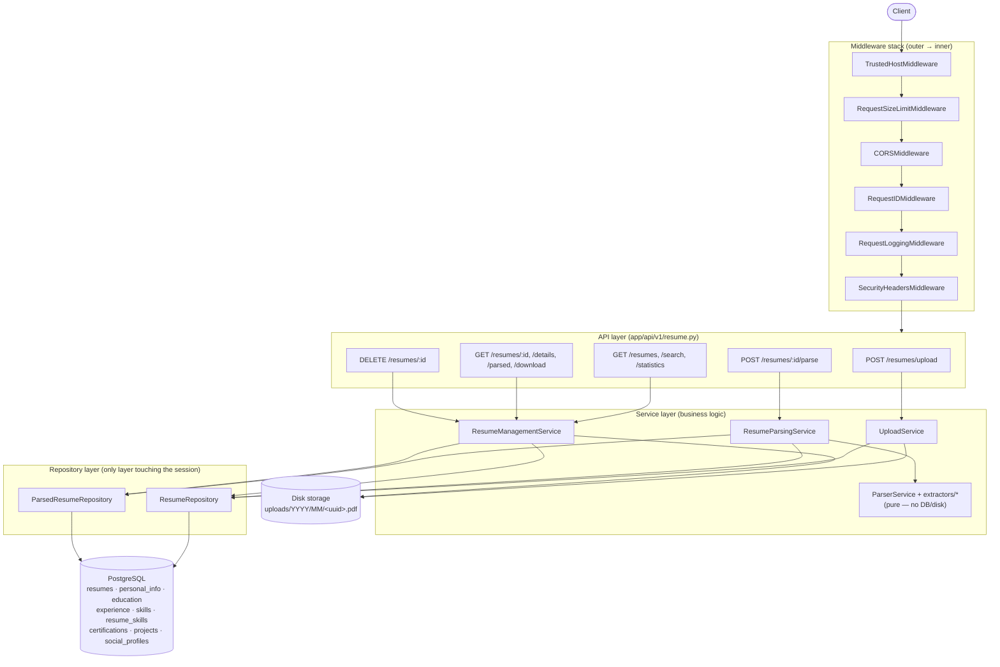

# Resume Parsing Service

[](https://github.com/DevKadiya7/Resume_Parsing/actions/workflows/backend.yml)


A full-stack resume parsing platform: a production-hardened FastAPI backend
that accepts PDF resumes, stores them, and extracts structured information
from them — all **without an LLM or external AI API** — plus a React
frontend that consumes those APIs end to end (upload, parse, browse, search,
manage). This is the **single README for both `backend/` and `frontend/`**;
neither subdirectory has its own.

<!--
Screenshots (placeholder — add real captures before publishing):
  docs/screenshots/dashboard.png      — frontend Dashboard page
  docs/screenshots/upload-flow.png    — drag-and-drop upload -> parse walkthrough
  docs/screenshots/swagger-ui.png     — backend Swagger UI at /docs
-->

## Monorepo Structure

```
Resume_Parsing/
├── backend/     # FastAPI + SQLAlchemy 2.0 + PostgreSQL API (see "Backend" below)
├── frontend/    # React + Vite + Tailwind CSS UI (see "Frontend" below)
├── .github/workflows/backend.yml   # CI: lint -> test -> Docker build
├── LICENSE
└── README.md    # you are here
```

## Quick Start

```bash
git clone <this-repo>
cd Resume_Parsing

# 1. Backend (Postgres + API) — http://localhost:8000
cd backend
cp .env.example .env
docker compose up --build -d

# 2. Frontend — http://localhost:5173
cd ../frontend
cp .env.example .env
npm install
npm run dev
```

---

# Backend

A production-hardened backend that accepts PDF resumes, stores them, extracts
structured information from them, and exposes that data through a searchable,
paginated API. Extraction is done entirely with PyMuPDF (text), regex
(patterns), spaCy (name NER, optional), and dateparser (dates). Built
end-to-end with Clean Architecture, a fully async SQLAlchemy 2.0 stack, and a
CI pipeline that lints, type-checks, tests, and builds the Docker image on
every push.

### Project Overview

| Phase | Scope |
|-------|-------|
| **1 — Foundation** | Project setup, PostgreSQL integration, PDF upload, clean architecture |
| **2 — Parsing engine** | Regex/spaCy/dateparser extraction into 7 normalized tables |
| **3 — Management APIs** | Paginated listing, multi-field search, filtering, statistics, delete, download |
| **4 — Production hardening** | Security, structured logging, config-per-environment, performance, CI/CD, Docker |

### Architecture Diagram



Every arrow crossing a layer boundary goes through an abstraction (a service
depends on a repository *interface*-shaped class, never a session; a route
depends on a service, never a repository) — see [Backend Design Decisions](#backend-design-decisions).

### Features

- **Upload** — PDF-only, 10MB limit, UUID storage filenames, date-partitioned storage.
- **Parse** — personal info, skills, education, experience, projects, certifications, social profiles — regex/spaCy/dateparser, no LLM.
- **List / Search / Filter** — pagination, sorting, 12 searchable fields, structural filters (`parsed`, `has_experience`, `minimum_experience`, ...).
- **Statistics** — corpus-wide counts and top skills/companies/colleges/degrees.
- **Delete / Download** — cascading delete (file + all parsed data), original-PDF download with correct headers.
- **Security** — TrustedHost + CORS + security headers, request-size limiting, per-endpoint rate limiting, path-traversal-safe filenames.
- **Observability** — request ID on every request/log line, request timing, structured (JSON) or human-readable logs, a health check that actually checks the database and disk.
- **Environments** — validated, fail-fast settings for development/testing/production.
- **CI/CD** — lint + test + Docker build on every push/PR.

### Technology Stack

Python 3.12 · FastAPI · Uvicorn · SQLAlchemy 2.0 (async) · Alembic · PostgreSQL ·
Pydantic v2 · PyMuPDF · spaCy · dateparser · slowapi · Docker · Docker Compose ·
Pytest · black · isort · flake8 · mypy · GitHub Actions

### Folder Structure

```
backend/
├── app/
│   ├── api/
│   │   ├── deps.py                       # DI wiring for the whole dependency graph
│   │   └── v1/resume.py                  # upload, parse, list/search/stats, detail, delete, download
│   ├── core/
│   │   ├── config.py                     # Settings (env-validated), Environment enum
│   │   ├── logger.py                     # Text/JSON logging, request-ID injection
│   │   ├── request_context.py            # ContextVar carrying the current request ID
│   │   └── rate_limiter.py               # Shared slowapi Limiter
│   ├── db/database.py                    # Async engine, session factory, Base
│   ├── models/                           # SQLAlchemy 2.0 ORM models
│   │   ├── resume.py                     #   Resume, ResumeStatus
│   │   ├── personal_info.py              #   PersonalInfo (1:1 with Resume)
│   │   ├── social_profile.py             #   SocialProfile, SocialPlatform
│   │   ├── education.py / experience.py
│   │   ├── skill.py                      #   Skill (global catalog), ResumeSkill (join table)
│   │   ├── certification.py / project.py
│   ├── repositories/                     # Only layer that touches the DB session
│   │   ├── resume_repository.py          #   CRUD + find_all/search/statistics/delete
│   │   └── parsed_resume_repository.py   #   Parsed-data aggregate: save (transactional) + fetch
│   ├── services/
│   │   ├── upload_service.py             # Validation, storage, persistence
│   │   ├── parser_service.py             # Pure: PDF bytes -> ParsedResumeData
│   │   ├── resume_parsing_service.py     # Orchestration: fetch, dedupe-guard, parse, persist
│   │   ├── resume_management_service.py  # Orchestration: list/search/detail/stats/delete/download
│   │   └── extractors/                   # One module per extraction concern
│   ├── schemas/                          # Pydantic v2 request/response + internal criteria
│   ├── utils/                            # file_utils, skills, date_utils, query_params, experience_calculator
│   ├── middleware/
│   │   ├── request_id_middleware.py
│   │   ├── logging_middleware.py
│   │   ├── security_headers_middleware.py
│   │   ├── size_limit_middleware.py
│   │   └── exception_handler.py          # Global exception handlers -> consistent JSON errors
│   ├── exceptions/custom_exceptions.py   # AppException hierarchy
│   └── main.py                           # FastAPI app, middleware stack, routes, lifespan
├── uploads/                              # PDF storage, partitioned uploads/<year>/<month>/
├── tests/                                # 85 tests, in-memory/temp-file SQLite, no Docker required
├── alembic/                               # Migrations (async env.py)
├── Dockerfile                             # multi-stage, non-root, HEALTHCHECK
├── docker-compose.yml
├── pyproject.toml                         # black/isort/mypy config
├── .flake8
├── requirements.txt
└── .env.example / .env.test / .env.production
```

### Installation

```bash
cd backend
cp .env.example .env
```

### Running with Docker

```bash
docker compose up --build
```

Starts Postgres (with a healthcheck-gated startup) and the API on
`http://localhost:8000`. The image is a multi-stage build: dependencies
(including the spaCy model) are installed in a `builder` stage with the full
build toolchain, and only the resulting virtualenv + app code are copied into
the slim, non-root `runtime` stage — which also carries a `HEALTHCHECK`
hitting `/health`.

### Running Locally

```bash
python -m venv .venv
source .venv/Scripts/activate   # Windows Git Bash; use .venv\Scripts\Activate.ps1 on PowerShell
pip install -r requirements.txt
python -m spacy download en_core_web_sm   # optional: enables NER-based name fallback

alembic upgrade head             # requires a running Postgres reachable at DATABASE_URL
uvicorn app.main:app --reload
```

### Environment Variables

| Variable | Description | Default |
|----------|-------------|---------|
| `ENVIRONMENT` | `development` \| `testing` \| `production` — gates production hardening checks | `development` |
| `APP_NAME` | Service name shown in OpenAPI docs | `Resume Parsing Service` |
| `DEBUG` | Enables SQL echo + `DEBUG`-level logging | `False` |
| `DATABASE_URL` | Async SQLAlchemy URL (`asyncpg` driver) | `postgresql+asyncpg://...` |
| `UPLOAD_DIRECTORY` | Root directory PDFs are written to (date-partitioned beneath it) | `uploads` |
| `MAX_FILE_SIZE` | Max PDF size in bytes (business-rule check) | `10485760` (10 MB) |
| `MAX_REQUEST_SIZE` | Hard cap on any request body, checked before routing | `12582912` (12 MB) |
| `ALLOWED_HOSTS` | Comma-separated allowed `Host` headers; `*` in dev, explicit list required in production | `*` |
| `ALLOWED_ORIGINS` | Comma-separated CORS origins; `*` in dev, explicit list required in production | `*` |
| `RATE_LIMIT_UPLOAD` | slowapi rate-limit string for `POST /upload` | `20/minute` |
| `RATE_LIMIT_PARSE` | slowapi rate-limit string for `POST /{id}/parse` | `20/minute` |
| `LOG_FORMAT` | `text` (console) or `json` (structured, for log aggregators) | `text` |

Three files are provided in `backend/`:
- **`.env.example`** — local development, copy to `.env`.
- **`.env.test`** — reference only; the test suite overrides settings in-process (see Testing below) and never reads this file.
- **`.env.production`** — a template to fill in and rename; `Settings` refuses to start with `ENVIRONMENT=production` if `DEBUG`, `ALLOWED_HOSTS`, `ALLOWED_ORIGINS`, or `DATABASE_URL` are still left at permissive/local defaults.

### Database Migration

```bash
alembic upgrade head                              # apply all migrations
alembic revision --autogenerate -m "Description"  # after changing a model
```

| Migration | Adds |
|-----------|------|
| `202608040001_initial` | `resumes` |
| `202608040002_add_parsed_resume_tables` | `personal_info`, `social_profiles`, `education`, `experience`, `skills`, `resume_skills`, `certifications`, `projects` — all FK'd to `resumes.id` with `ON DELETE CASCADE` |
| `202608040003_add_query_indexes` | Indexes on every sorted/filtered/searched column |

### Testing

```bash
cd backend
pip install -r requirements.txt
pytest -v
```

**85 tests, no Docker/Postgres required** — an in-memory-per-process,
file-based SQLite database (not `:memory:` + a single shared connection,
which can't run overlapping transactions — see the comment in
`backend/tests/conftest.py`) and a `tmp_path` upload directory, wired in via
FastAPI dependency overrides so production code paths run unmodified.

| File | Covers |
|------|--------|
| `test_health.py` | Root + health endpoint (DB/upload-dir/version/uptime) |
| `test_upload.py` | Valid upload, reject non-PDF, reject oversized, reject missing |
| `test_parser_service.py` | Extraction unit tests: multi-page, missing sections, corrupted/encrypted/empty PDFs, skill/email/phone parsing |
| `test_parse_api.py` | Parse/get-parsed HTTP flows, corrupted/encrypted/empty PDF (422), missing-on-disk (500), duplicate parse (409), not-found (404) |
| `test_resume_management.py` | Pagination, sorting, filtering, search (single + combined fields), statistics, delete, download |
| `test_edge_cases.py` | Large (multi-page) resume, tiny resume, Unicode resume, duplicate upload, concurrent upload |
| `test_security.py` | Request ID, response-time header, security headers, CORS, 413 on oversized body, filename sanitization/rejection |
| `test_file_utils.py` | Filename safety helpers as pure unit tests |
| `test_config.py` | Production settings validation, comma-separated env parsing |
| `test_rate_limiting.py` | The shared rate limiter actually blocks after its configured limit |

Code quality — all clean on this codebase:

```bash
black --check app tests
isort --check-only app tests
flake8 app tests
mypy app
```

### API Documentation

Swagger UI: `http://localhost:8000/docs` · ReDoc: `/redoc` · raw schema: `/openapi.json`.
Every endpoint has a `summary`, a `description`, a `response_model`, documented
error responses, and — for the response bodies clients most need to
understand — a worked JSON example embedded via `json_schema_extra`.

#### Endpoints

| Method | Path | Description |
|--------|------|--------------|
| GET | `/` | Service info |
| GET | `/health` | DB connectivity, upload-dir check, version, uptime |
| POST | `/api/v1/resumes/upload` | Upload a PDF resume (rate-limited) |
| GET | `/api/v1/resumes` | List resumes — pagination, sorting, filters |
| GET | `/api/v1/resumes/search` | Multi-field partial/case-insensitive search |
| GET | `/api/v1/resumes/statistics` | Corpus-wide aggregate statistics |
| POST | `/api/v1/resumes/{resume_id}/parse` | Parse an uploaded resume (rate-limited) |
| GET | `/api/v1/resumes/{resume_id}/parsed` | Fetch parsed data (404 if not parsed yet) |
| GET | `/api/v1/resumes/{resume_id}/details` | Metadata + full nested parsed data |
| GET | `/api/v1/resumes/{resume_id}/download` | Download the original PDF |
| GET | `/api/v1/resumes/{resume_id}` | Single resume's metadata |
| DELETE | `/api/v1/resumes/{resume_id}` | Delete (file + metadata + parsed data, cascades) |

> **Route-ordering note:** `/search` and `/statistics` are registered before
> the dynamic `/{resume_id}` in `app/api/v1/resume.py` — otherwise FastAPI
> would try to parse "search"/"statistics" as a UUID and 422 instead of
> reaching the real handler.

### Example Requests

```bash
# Upload
curl -X POST http://localhost:8000/api/v1/resumes/upload \
  -F "file=@jane_doe_resume.pdf;type=application/pdf"

# Parse
curl -X POST http://localhost:8000/api/v1/resumes/3fa85f64-5717-4562-b3fc-2c963f66afa6/parse

# List — page 2, 10 per page, newest first, only parsed resumes
curl "http://localhost:8000/api/v1/resumes?page=2&page_size=10&sort=created_at&order=desc&parsed=true"

# Search — Python developers who worked at Google
curl "http://localhost:8000/api/v1/resumes/search?skill=python&company=google"

# Statistics
curl "http://localhost:8000/api/v1/resumes/statistics"

# Delete
curl -X DELETE http://localhost:8000/api/v1/resumes/3fa85f64-5717-4562-b3fc-2c963f66afa6

# Download
curl -OJ http://localhost:8000/api/v1/resumes/3fa85f64-5717-4562-b3fc-2c963f66afa6/download
```

### Example Responses

<details>
<summary><code>POST /api/v1/resumes/upload</code> → 201</summary>

```json
{
  "id": "3fa85f64-5717-4562-b3fc-2c963f66afa6",
  "filename": "jane_doe_resume.pdf",
  "status": "UPLOADED",
  "created_at": "2026-08-05T10:15:30Z"
}
```
</details>

<details>
<summary><code>POST /api/v1/resumes/{id}/parse</code> → 200</summary>

```json
{
  "success": true,
  "resume_id": "3fa85f64-5717-4562-b3fc-2c963f66afa6",
  "parsed": {
    "personal_info": {"full_name": "Jane Doe", "email": "jane.doe@example.com", "phone": "+1 555-123-4567", "address": "San Francisco, CA", "summary": "..."},
    "skills": ["Docker", "FastAPI", "Python", "SQL"],
    "education": [{"institution": "MIT", "degree": "B.Tech", "field_of_study": "Computer Science", "start_date": "2015-08-01", "end_date": "2019-05-01", "grade": "8.7 CGPA"}],
    "experience": [{"company": "Google", "job_title": "Software Engineer", "location": "Mountain View, CA", "start_date": "2020-01-01", "end_date": null, "is_current": true, "description": "..."}],
    "projects": [{"name": "Resume Parser", "description": "...", "technologies": "Python, FastAPI"}],
    "certifications": [{"name": "AWS Certified Solutions Architect", "issuer": "Amazon Web Services", "date": "2021-06-01"}],
    "social_profiles": [{"platform": "LINKEDIN", "url": "linkedin.com/in/janedoe"}]
  }
}
```
</details>

<details>
<summary><code>GET /api/v1/resumes</code> → 200</summary>

```json
{
  "page": 1, "page_size": 20, "total": 54,
  "items": [
    {"id": "3fa85f64-...", "filename": "jane_doe_resume.pdf", "status": "UPLOADED",
     "file_size": 245678, "content_type": "application/pdf", "is_parsed": true,
     "created_at": "2026-08-05T10:15:30Z", "updated_at": "2026-08-05T10:15:35Z"}
  ]
}
```
</details>

<details>
<summary><code>GET /api/v1/resumes/statistics</code> → 200</summary>

```json
{
  "total_resumes": 120, "parsed": 118, "pending": 2,
  "top_skills": [{"skill": "Python", "count": 85}],
  "top_companies": [{"company": "Google", "count": 12}],
  "top_colleges": [{"college": "MIT", "count": 9}],
  "most_common_degree": [{"degree": "B.Tech", "count": 40}]
}
```
</details>

<details>
<summary>Any error → consistent envelope</summary>

```json
{"success": false, "message": "Only PDF files are allowed."}
```
</details>

### Backend Design Decisions

- **Layering is enforced, not just documented.** Routes only translate HTTP
  ↔ schemas and delegate to services; services hold all business logic and
  depend on repository *classes* (never the session directly); repositories
  are the only layer that imports `AsyncSession`. `app/api/deps.py` wires the
  whole `session → repository → service` graph in one place.

- **`ParserService` is pure.** It takes raw PDF bytes and returns structured
  data — no DB, no disk — so it's unit-testable with synthetic PDF bytes and
  no test database (see `test_parser_service.py`). Persistence and
  resume-lookup live in `ResumeParsingService`, the orchestrator.

- **Schemas double as cross-layer DTOs.** `ParsedResumeData` and friends are
  returned by the parser, persisted/reconstructed by the repository (via
  `from_attributes`), and serialized directly as the API response — one type
  instead of a parallel dataclass hierarchy that exists only to be converted
  back and forth.

- **`EXISTS` subqueries, not `JOIN + DISTINCT`, for search/filtering.** Each
  search field lives on a different one-to-many child table; joining several
  would multiply `Resume` rows (one row per matching child row), needing
  `DISTINCT` cleanup. A correlated `EXISTS` per condition avoids that
  entirely and lets each subquery use its own index. `is_parsed` is computed
  the same way, inline in the listing query — one query returns a full page
  plus parsed-status, never one query per resume (no N+1).

- **`minimum_experience` is computed in Python, not SQL.** Total years of
  experience is a derived value (summed date-range durations) that isn't
  expressible as one SQL expression portable across Postgres and SQLite
  without dialect-specific date arithmetic. All *other* filters are still
  applied in SQL to get a candidate set first; only the derived-value
  computation runs in Python, over that (typically small) set.

- **Rate limits are per-route decorators (slowapi), not global middleware.**
  The spec calls for limiting upload/parse specifically, not every endpoint;
  a decorator keeps that scoping explicit at the route rather than requiring
  a middleware-level allow/deny-list.

- **Request ID via `ContextVar`, not a threaded parameter.** Any log
  statement anywhere in the call stack picks up the current request's ID
  automatically (`app.core.logger`'s filter reads the `ContextVar`), instead
  of every function needing a `request_id` parameter passed through it.

- **`Settings` fails fast on insecure production config**, rather than
  silently running with development-friendly defaults (`DEBUG=True`,
  `ALLOWED_HOSTS=["*"]`) in production. A `model_validator` raises at
  startup if `ENVIRONMENT=production` but any of those are still permissive.

- **File storage is date-partitioned** (`uploads/<year>/<month>/<uuid>.pdf`)
  so no single directory accumulates an unbounded number of entries as the
  corpus grows — relevant for filesystem/backup tooling that degrades badly
  on very large directories.

- **Filenames: sanitize vs. reject.** A client-supplied filename with merely
  awkward characters (`résumé<>:.pdf`) is *sanitized* (control/reserved
  characters stripped, still succeeds); one showing clear intent to escape
  the upload directory (`../../etc/passwd`, a null byte, an absolute path)
  is *rejected outright* (400) — the file is always written under a
  generated UUID name regardless, so neither path ever risks writing outside
  `UPLOAD_DIRECTORY`.

- **The health check depends on `Depends(get_db)` like every other route**,
  rather than importing the module-level production `engine` directly —
  otherwise the test suite's DB override would be silently bypassed.

- **The full test suite runs against file-based SQLite, not `:memory:` +
  `StaticPool`.** A single shared in-memory connection can't run two
  overlapping transactions; a temp-file SQLite DB with normal connection
  pooling tolerates real concurrency, much closer to how pooled Postgres
  behaves in production.

### Trade-offs

- **No ML/LLM extraction** (by design) means name/company/title splitting
  and address extraction are heuristic and regex-based; documented
  limitations live as docstrings next to the relevant extractor
  (`app/services/extractors/`).
- **`CSP` is intentionally not set** in `SecurityHeadersMiddleware` — this is
  a JSON API with no HTML of its own beyond Swagger UI's bundled assets, and
  a strict CSP would break those without a corresponding security benefit.
- **In-memory rate limiting** (slowapi's default storage) is single-process;
  a multi-instance deployment would need `Limiter(storage_uri="redis://...")`.
- **B-tree indexes don't meaningfully accelerate leading-wildcard
  `%value%` search.** A deployment doing heavy free-text search would add
  Postgres trigram/GIN indexes — left out here to avoid an extension
  dependency for a feature not in scope.
- **`minimum_experience` filtering is Python-side** over a SQL-narrowed
  candidate set rather than fully pushed to SQL — the right trade-off for
  portability given the dual SQLite/Postgres test-vs-production setup.
- **A known, accepted race condition:** two resumes introducing the same
  brand-new skill concurrently can race on `Skill.name`'s unique constraint;
  whichever commits second fails cleanly with a retryable 500 rather than
  corrupting data (documented in `ParsedResumeRepository._resolve_skill_ids`).
- **No authentication/authorization layer.** Every endpoint is currently
  open — the single biggest gap before a real production deployment (see
  Future Improvements).

### Future Improvements

- Add an authentication/authorization layer — the most important gap.
- Persist a materialized `total_experience_years` column (updated at parse
  time) to make `minimum_experience` filtering fully SQL-side at any scale.
- Move rate-limit storage to Redis for multi-instance deployments.
- Add Postgres trigram (`pg_trgm`) indexes for substring search at scale.
- OpenTelemetry tracing, correlated via the existing request ID.
- Signed, expiring download URLs instead of an unauthenticated download
  endpoint, if this service is ever exposed beyond a trusted internal network.

---

# Frontend

A React.js (JavaScript, no TypeScript) frontend that consumes the backend's
REST API only — nothing here modifies or duplicates backend logic.

### Tech Stack

React 18 · Vite · React Router DOM · Axios · Tailwind CSS · React Hook Form ·
React Icons. Global state (toast notifications) uses the Context API — no
Redux, per the project's stated constraints.

### Installation

```bash
cd frontend
npm install
cp .env.example .env   # adjust VITE_API_BASE_URL if the backend isn't on localhost:8000
npm run dev
```

The app runs at `http://localhost:5173` and expects the backend at
`http://localhost:8000/api/v1` by default (see `frontend/.env.example`).

```bash
npm run build     # production build -> dist/
npm run preview   # serve the production build locally
npm run lint      # ESLint
```

### Folder Structure

```
frontend/
├── src/
│   ├── components/       # Reusable, presentation-focused pieces
│   │   ├── Navbar.jsx / Sidebar.jsx / Footer.jsx
│   │   ├── StatCard.jsx / Pagination.jsx / SearchBar.jsx / FilterPanel.jsx
│   │   ├── ResumeTable.jsx
│   │   ├── SkillBadge.jsx / StatusBadge.jsx
│   │   ├── EducationCard.jsx / ExperienceCard.jsx / ProjectCard.jsx / CertificationCard.jsx
│   │   ├── SocialLinks.jsx
│   │   ├── UploadCard.jsx        # drag & drop upload with progress
│   │   ├── LoadingSpinner.jsx / Skeleton.jsx / EmptyState.jsx
│   │   ├── ConfirmModal.jsx
│   │   └── Toast.jsx / ToastContainer.jsx
│   ├── pages/             # One component per route
│   │   ├── Dashboard.jsx
│   │   ├── UploadResume.jsx
│   │   ├── ResumeList.jsx
│   │   ├── ResumeDetails.jsx
│   │   ├── SearchPage.jsx
│   │   └── NotFound.jsx
│   ├── layouts/
│   │   └── MainLayout.jsx  # sticky Navbar + Sidebar + Footer around <Outlet />
│   ├── services/
│   │   ├── api.js          # Axios instance: base URL, timeout, error normalization
│   │   └── resumeService.js # one function per backend endpoint
│   ├── hooks/
│   │   ├── useDebounce.js   # debounced search inputs
│   │   ├── useResumes.js    # shared paginated-fetch state for List/Search pages
│   │   └── useToast.js      # access to the global toast context
│   ├── context/
│   │   ├── toastCore.js     # the raw Context object
│   │   └── ToastContext.jsx # ToastProvider (the one place global state is used)
│   ├── utils/
│   │   ├── constants.js
│   │   ├── formatDate.js
│   │   └── formatFileSize.js
│   ├── assets/
│   ├── App.jsx              # route table
│   └── main.jsx              # entrypoint: BrowserRouter + ToastProvider + App
├── index.html
├── vite.config.js
├── tailwind.config.js / postcss.config.js
├── .env.example
└── package.json
```

### Routing

| Path | Page |
|------|------|
| `/` | Dashboard — totals, top skills, recent uploads |
| `/upload` | Drag-and-drop PDF upload |
| `/resumes` | Paginated list — search, filter, sort, parse/view/download/delete |
| `/resumes/:id` | Full parsed details — personal info, skills, education, experience, projects, certifications, social links |
| `/search` | Multi-field search (name, skill, company, degree, college, email) |

### API Configuration

`src/services/api.js` creates one shared Axios instance:

- **Base URL** comes from `VITE_API_BASE_URL` (`.env`), defaulting to
  `http://localhost:8000/api/v1`.
- **Response interceptor** normalizes every failure — a network error, a
  timeout, or a backend `{"success": false, "message": "..."}` error body —
  into a single `{ status, message }` shape, so no component needs to know
  which case it's in before showing a message.

`src/services/resumeService.js` wraps every endpoint the backend exposes
(upload, list, search, statistics, parse, get parsed data, get details,
download, get one, delete) as a single function each — pages never call
`axios`/`api` directly.

### Frontend Design Notes

- **No Redux, minimal Context.** Only toast notifications use the Context
  API (`ToastContext`) — they're the one piece of state genuinely needed
  from arbitrarily deep components (an upload success, a delete confirmation,
  a parse error inside a table row) without prop-drilling. Everything else
  (pagination, filters, search text, modal open/close state) is local
  `useState` in the page that owns it.
- **`useResumes` is shared, not duplicated,** between the Resume List and
  Search pages — both endpoints return the identical
  `{ page, page_size, total, items }` envelope, so one hook covers both.
- **Download navigates directly to the backend's download URL** (via a
  temporary `<a>` tag) rather than fetching the PDF through Axios and
  building a blob URL — the backend already sets `Content-Disposition` on
  that response, so the browser handles the "Save As" behavior for free.
- **Client-side PDF/size validation in `UploadCard`** mirrors the backend's
  rules (PDF only, 10MB max) purely for immediate feedback — the backend's
  validation remains the actual source of truth.

---

## License

[MIT](LICENSE)

## Git Commit Messages

Each phase of this project was committed separately:

```
feat: initialize resume parsing backend with upload service
feat: implement resume parsing engine and structured data extraction
feat: implement resume retrieval search and management APIs
chore: production hardening, documentation and deployment improvements
refactor: final code review and production polish
feat: build professional React.js frontend for resume parsing service
```
